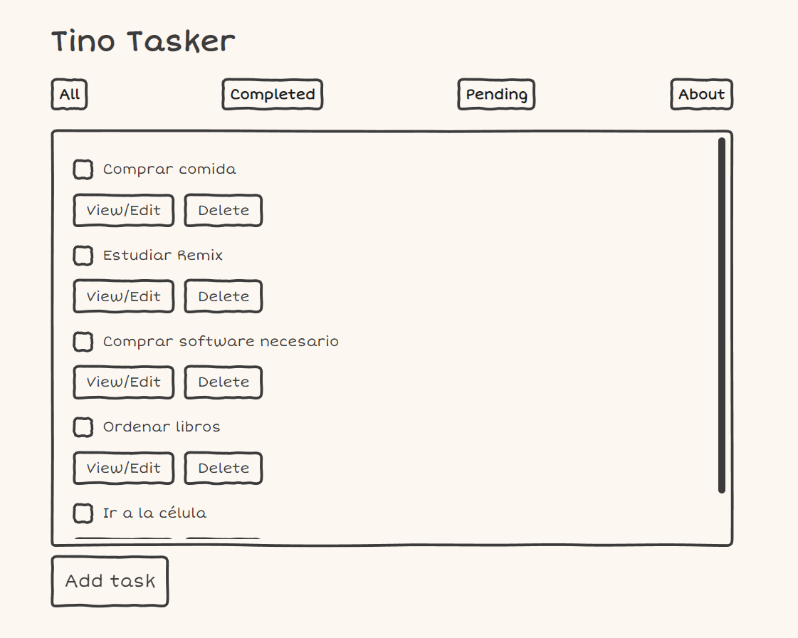

# Tino's reusable input with Vite + React

Solution for a challenge from  <a href="http://devchallenges.io" target="_blank">Devchallenges.io</a>.

[Demo](https://tino-tasker.vercel.app/) | 
[Solution](https://github.com/tinoreyna1984/tino-tasker) | 
[Challenge](https://devchallenges.io/challenges/hH6PbOHBdPm6otzw2De5)

## Table of Contents

- [Overview](#overview)
- [Built With](#built-with)
- [Features](#features)
- [How to use](#how-to-use)
- [Contact](#contact)
- [Acknowledgements](#acknowledgements)

## Overview



This is a typical frontend project in which someone lists all his personal tasks and tracks them in order to see their status, either those are completed or pending (or active as the challenge says). The following stories are fulfilled:
* You can add a new task.
* You can edit any task, aside of checking it as completed.
* In the general task list, you can delete any task.
* In the completed task list, you can delete one completed task or all completed task (a confirmation prompt appears to help you to decide the elimination of these tasks).
* If you want to add a task, you must put a title and some comments to explain about the new task.
* The task list is stored locally, so you can have a persistant list in your browser storage and see it in any site refresh.
* This app is a PWA.
* Improvement TODO: use a BaaS (Firebase, auth0, etc) to create an account to the app and replace the local storage with a more persistent storage (i.e. a database).

### Built With

- [React](https://reactjs.org/) + [CRA](https://create-react-app.dev/)
- [SASS](https://sass-lang.com/): CSS with superpowers
- [Redux Toolkit](https://redux.js.org/)
- [Doodle.CSS](https://chr15m.github.io/DoodleCSS/)

## Features

This application/site was created as a submission to a [DevChallenges](https://devchallenges.io/challenges) challenge. The [challenge](https://devchallenges.io/challenges/hH6PbOHBdPm6otzw2De5) was to build an application to complete the given user stories.

## How To Use

To clone and run this application, you'll need [Git](https://git-scm.com) and [Node.js](https://nodejs.org/en/download/) (which comes with [npm](http://npmjs.com)) installed on your computer. From your command line:

```bash
# Clone this repository
$ git clone https://github.com/tinoreyna1984/tino-tasker

# Install dependencies
$ npm i

# Run the app
$ npm start
```

## Acknowledgements

- [Node.js](https://nodejs.org/)
- [Marked - a markdown parser](https://github.com/chjj/marked)
- My teachers.

## Contact

- Website [TinexLab](https://tinexlab.vercel.app/)
- GitHub [@tinoreyna1984](https://github.com/tinoreyna1984)
- Twitter [@tinoreyna1984](https://twitter.com/tinoreyna1984)
